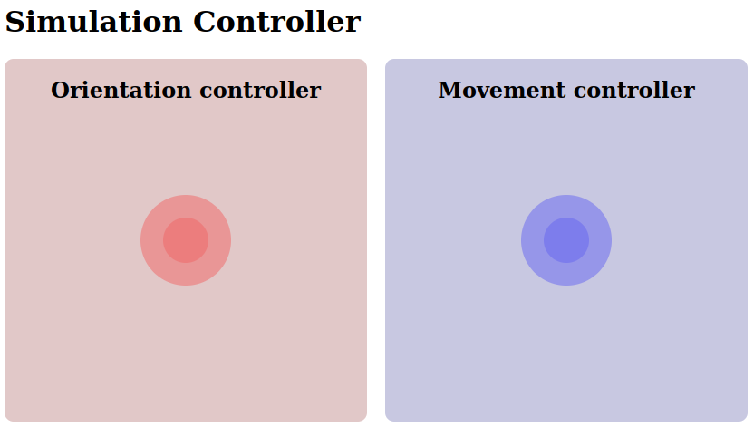

# ROS JoyJS

A virtual controller for ROS using NippleJS and Rosbridge.

## Usage

### Docker

- Build the image `docker compose build ros_joy_js`
- Run the local web server `docker compose run ros_joy_js`
- Get your IP `hostname -I` and navigate to `http://192.168.21.33:5000` (replace your ip)

Freewheeling inside the container to run custom commands: `docker compose run ros_joy_js bash`

### Native

- Match dependencies:
    - Ros Melodic 
    - Node package manager `apt install nodejs npm`
    - Node packages `npm i express fs ip` 
- Source this env and run `roslaunch ros_joy_js ros_joy_js`
- Get your IP `hostname -I` and navigate to `http://192.168.21.33:5000` (replace your ip)

## Launch files description

- `ros_joy_js.launch`: Main application, launches local web server. Optional args:
    - `port`: where to host the app
    - `topic`: topic where Twist messages will be published to
- `test.launch`: Launches `ros_joy_js.launch` PLUS a `rostopic echo` to get joystick feedback without a frontend

## Further reading

#### Nodejs briefing for non-JS programmers

A website is composed of two elements:

- Server-side: We use `node` to run JS on a linux server. 
    - The server is launched through the node script `scripts/index.js`
    - This sets up a simple http server with custom HTTP request handling.  
- Browser-side: browsers run JS code natively. The source files delivered to the browser are hosted in `app/`. 
    - The browser looks for `index.html`, which contains explicit links to any other needed files. 
    - Because we cannot import modules in the browser with the JS standard `require()`, these are typically included as `*.min.js` library files. They are usually fetched from the internet, but can be predownloaded to use apps locally without an internet connection (see `app/lib/`).

#### ROS-Node version conflicts

ROS melodic is not compatible with the `nodejs` companion `npm` in the base image ubuntu version, hence the node modules are copied directly into the image. To avoid matching `npm` dependencies in the docker host to be able to install these, this repo includes the `node_modules` folder. This is usually not done since these packages can be quite heavy, however our node dependencies weight just about 3.5MB. 
