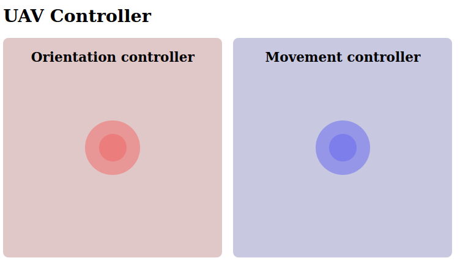

# ROS JoyJS

A virtual controller for ROS using NippleJS and Rosbridge.



It allows you to control an UAV in ROS simulations from a simple webpapp thanks to Rosbridge.

- Move the UAV with the right joystick. 

- Change its orientation using the left joystick.

The controller is executed with roslaunch, like a regular ROS node/pkg, and you can use it from your computer or your phone.


## Dependencies
- **[ROS Noetic](http://wiki.ros.org/noetic)**: provides the main code to develop robot applications.
- **[Rosbridge](http://wiki.ros.org/rosbridge_suite/Tutorials/RunningRosbridge)**: provides a JSON API to ROS functionality for non-ROS programs.
- **[NippleJS](https://yoannmoi.net/nipplejs/)**: provides a virtual joystick for touch capable interfaces.


## Setup

**Clone the repo inside your ROS project, in the *src* folder**
```
cd src
git clone https://bitbucket.org/fadacatec-ondemand/ros_joy_js.git
```


## Usage
We will run the controller using **roslaunch**:

### PC

**1.** Go to your project folder 

**2.** Source ROS workspace
```
source devel/setup.bash
```
**3.** Execute the *run.launch* file
```
roslaunch ros_joy_js run.launch
```
  This will run everything in the same terminal and open the webapp in browser

 Close it with `ctrl+c`

**Now you can use the controller from your PC!!!**


### Phone

You can also control the UAV with your phone:

**1.** Make sure your PC and phone are connected to the same WiFi

**2.** Change the IP address in the *hostname* file with your PC IP

**3.** Go to the project folder

**4.** Source ROS workspace
```
source devel/setup.bash
```
**5.** Execute the *phoneRun.launch* file
```
roslaunch ros_joy_js phoneRun.launch
```
  - If you want to change it, you can pass the topic name as an argument

**6.** Open the `IP:8000` in your phone browser

**Now you can use your phone as a controller!!!**
